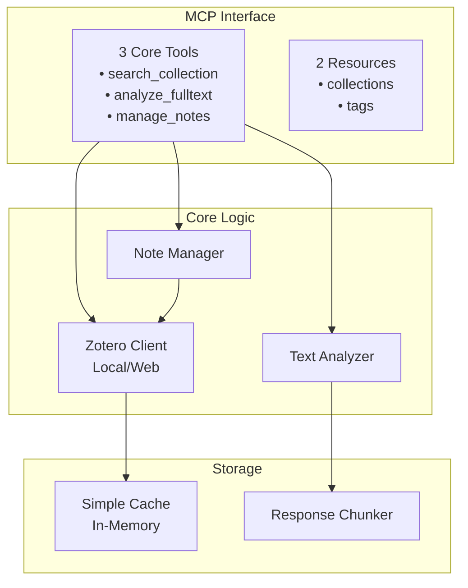

# Zotero MCP Server v2.0 - Simplified Design

## Core Mission

Оценка научных источников в коллекциях Zotero, анализ полных текстов и создание качественных аннотаций.

## Design Principles

- **KISS** - Keep It Simple, Stupid
- **YAGNI** - You Aren't Gonna Need It
- **Focus** - Только критически важный функционал
- **Type Safety** - Pydantic models везде вместо словарей

## Minimal Architecture



## Project Structure (Minimal)

```text
zotero-mcp-simple/
├── src/
│   ├── mcp_server.py          # FastMCP server with tools
│   ├── zotero_client.py       # Simple client (local/web)
│   ├── text_analyzer.py       # Full-text analysis
│   ├── note_manager.py        # Note CRUD operations
│   ├── chunker.py             # Response chunking
│   └── config.py              # Environment config
├── tests/
│   └── test_core.py           # Basic tests
├── requirements.txt
├── .env.example
└── README.md
```

## Core Components

### 1. Pydantic Models

```python
from pydantic import BaseModel, Field
from typing import Optional, List
from datetime import datetime
from enum import Enum

# Enums
class AnalysisType(str, Enum):
    SUMMARY = "summary"
    KEY_POINTS = "key_points"
    METHODS = "methods"
    BASIC = "basic"

class NoteAction(str, Enum):
    CREATE = "create"
    READ = "read"
    UPDATE = "update"
    SEARCH = "search"

# Request Models
class SearchCollectionRequest(BaseModel):
    collection_key: str
    query: Optional[str] = None
    include_fulltext: bool = False

class AnalyzeFulltextRequest(BaseModel):
    item_key: str
    analysis_type: AnalysisType = AnalysisType.SUMMARY

class ManageNotesRequest(BaseModel):
    action: NoteAction
    item_key: Optional[str] = None
    content: Optional[str] = None
    note_key: Optional[str] = None
    search_query: Optional[str] = None

# Data Models
class Author(BaseModel):
    first_name: str = ""
    last_name: str = ""

    @property
    def full_name(self) -> str:
        return f"{self.first_name} {self.last_name}".strip()

class ZoteroItem(BaseModel):
    key: str
    title: str
    abstract: str = Field(default="", alias="abstractNote")
    authors: List[Author] = []
    year: str = ""
    tags: List[str] = []
    fulltext: Optional[str] = None

class Note(BaseModel):
    key: str
    parent_key: Optional[str] = None
    content: str
    created: datetime
    modified: datetime
    tags: List[str] = []

class TextSummary(BaseModel):
    abstract: str
    introduction: str
    methods: str
    results: str
    conclusion: str
    word_count: int
    sections_found: List[str]

class MethodsAnalysis(BaseModel):
    study_type: str
    sample_size: Optional[str] = None
    statistical_methods: List[str] = []
    summary: str

# Response Models
class SearchCollectionResponse(BaseModel):
    items: List[ZoteroItem]
    count: int
    has_more: bool = False
    chunk_id: Optional[str] = None
    chunk_info: Optional[str] = None

class AnalyzeFulltextResponse(BaseModel):
    item_key: str
    title: str
    analysis_type: AnalysisType
    result: TextSummary | List[str] | MethodsAnalysis
    error: Optional[str] = None

class ManageNotesResponse(BaseModel):
    note: Optional[Note] = None
    notes: Optional[List[Note]] = None
    count: Optional[int] = None
    error: Optional[str] = None

class ChunkResponse(BaseModel):
    items: List[ZoteroItem]
    has_more: bool
    chunk_id: Optional[str] = None
    chunk_info: Optional[str] = None
    error: Optional[str] = None
```

### 2. MCP Tools with Pydantic

```python
from fastmcp import FastMCP, Context

mcp = FastMCP("zotero-mcp")

@mcp.tool()
async def search_collection(
    ctx: Context,
    request: SearchCollectionRequest
) -> SearchCollectionResponse:
    """
    Search and evaluate items in a specific collection.
    Returns items with abstracts and metadata for assessment.
    """
    client = get_client()

    # Get collection items
    items = await client.get_collection_items(request.collection_key)

    # Filter by query if provided
    if request.query:
        items = filter_items(items, request.query)

    # Include full text if requested
    if request.include_fulltext:
        for item in items:
            item.fulltext = await client.get_fulltext(item.key)

    # Chunk if needed
    if needs_chunking(items):
        return chunker.chunk_response(items)

    return SearchCollectionResponse(
        items=items,
        count=len(items)
    )

@mcp.tool()
async def analyze_fulltext(
    ctx: Context,
    request: AnalyzeFulltextRequest
) -> AnalyzeFulltextResponse:
    """
    Analyze full text of an article for research evaluation.
    """
    client = get_client()

    # Get item and full text
    item = await client.get_item(request.item_key)
    fulltext = await client.get_fulltext(request.item_key)

    if not fulltext:
        return AnalyzeFulltextResponse(
            item_key=request.item_key,
            title=item.title,
            analysis_type=request.analysis_type,
            result=[],
            error='No full text available'
        )

    # Perform analysis
    analyzer = TextAnalyzer()

    if request.analysis_type == AnalysisType.SUMMARY:
        result = analyzer.summarize(fulltext, item.abstract)
    elif request.analysis_type == AnalysisType.KEY_POINTS:
        result = analyzer.extract_key_points(fulltext)
    elif request.analysis_type == AnalysisType.METHODS:
        result = analyzer.extract_methods(fulltext)
    else:
        result = analyzer.basic_analysis(fulltext)

    return AnalyzeFulltextResponse(
        item_key=request.item_key,
        title=item.title,
        analysis_type=request.analysis_type,
        result=result
    )

@mcp.tool()
async def manage_notes(
    ctx: Context,
    request: ManageNotesRequest
) -> ManageNotesResponse:
    """
    Complete note management for research annotations.
    """
    client = get_client()
    note_manager = NoteManager(client)

    if request.action == NoteAction.CREATE:
        if not request.item_key or not request.content:
            return ManageNotesResponse(error='item_key and content required')
        note = await note_manager.create_note(request.item_key, request.content)
        return ManageNotesResponse(note=note)

    elif request.action == NoteAction.READ:
        if request.note_key:
            note = await note_manager.get_note(request.note_key)
            return ManageNotesResponse(note=note)
        elif request.item_key:
            notes = await note_manager.get_notes_for_item(request.item_key)
            return ManageNotesResponse(notes=notes, count=len(notes))
        else:
            return ManageNotesResponse(error='note_key or item_key required')

    elif request.action == NoteAction.UPDATE:
        if not request.note_key or not request.content:
            return ManageNotesResponse(error='note_key and content required')
        note = await note_manager.update_note(request.note_key, request.content)
        return ManageNotesResponse(note=note)

    elif request.action == NoteAction.SEARCH:
        if not request.search_query:
            return ManageNotesResponse(error='search_query required')
        notes = await note_manager.search_notes(request.search_query)
        return ManageNotesResponse(notes=notes, count=len(notes))

    return ManageNotesResponse(error='Invalid action')
```

### 3. Simple Zotero Client

```python
from typing import Optional, List
import os
from pyzotero import zotero
from .models import ZoteroItem, Author

class ZoteroClient:
    """Simplified client supporting both local and web access."""

    def __init__(self):
        if os.getenv('ZOTERO_LOCAL', 'false').lower() == 'true':
            self.mode = 'local'
            self.client = self._init_local_client()
        else:
            self.mode = 'web'
            self.client = self._init_web_client()

        self.cache = {}  # Simple in-memory cache

    def _init_web_client(self):
        library_id = os.getenv('ZOTERO_LIBRARY_ID')
        api_key = os.getenv('ZOTERO_API_KEY')
        library_type = os.getenv('ZOTERO_LIBRARY_TYPE', 'user')

        if not library_id or not api_key:
            raise ValueError("ZOTERO_LIBRARY_ID and ZOTERO_API_KEY required")

        return zotero.Zotero(library_id, library_type, api_key)

    def _init_local_client(self):
        # Use local Zotero SQLite database
        # Simplified implementation
        return LocalZoteroClient()

    async def get_collection_items(
        self,
        collection_key: str,
        include_children: bool = True
    ) -> List[ZoteroItem]:
        """Get all items in a collection."""
        cache_key = f"collection:{collection_key}"

        if cache_key in self.cache:
            return self.cache[cache_key]

        items = self.client.collection_items(collection_key)

        # Include child collections if requested
        if include_children:
            child_collections = self.client.collections_sub(collection_key)
            for child in child_collections:
                items.extend(
                    await self.get_collection_items(child['key'], False)
                )

        # Extract essential fields
        result = []
        for item in items:
            if item['data']['itemType'] != 'attachment':
                result.append(ZoteroItem(
                    key=item['key'],
                    title=item['data'].get('title', ''),
                    abstract=item['data'].get('abstractNote', ''),
                    authors=self._extract_authors(item['data']),
                    year=item['data'].get('date', ''),
                    tags=[tag['tag'] for tag in item['data'].get('tags', [])]
                ))

        self.cache[cache_key] = result
        return result

    async def get_fulltext(self, item_key: str) -> Optional[str]:
        """Get full text content if available."""
        cache_key = f"fulltext:{item_key}"

        if cache_key in self.cache:
            return self.cache[cache_key]

        # Try to get PDF attachment
        attachments = self.client.children(item_key)

        for attachment in attachments:
            if attachment['data'].get('contentType') == 'application/pdf':
                # In real implementation, extract text from PDF
                # For now, return placeholder
                content = f"[Full text extraction needed for {item_key}]"
                self.cache[cache_key] = content
                return content

        return None

    def _extract_authors(self, data: dict) -> List[Author]:
        """Extract author names from item data."""
        authors = []
        for creator in data.get('creators', []):
            if creator.get('creatorType') == 'author':
                authors.append(Author(
                    first_name=creator.get('firstName', ''),
                    last_name=creator.get('lastName', '')
                ))
        return authors

    async def get_item(self, item_key: str) -> ZoteroItem:
        """Get single item by key."""
        item = self.client.item(item_key)
        return ZoteroItem(
            key=item['key'],
            title=item['data'].get('title', ''),
            abstract=item['data'].get('abstractNote', ''),
            authors=self._extract_authors(item['data']),
            year=item['data'].get('date', ''),
            tags=[tag['tag'] for tag in item['data'].get('tags', [])]
        )
```

### 4. Text Analyzer

```python
from typing import List, Optional
import re
from .models import TextSummary, MethodsAnalysis

class TextAnalyzer:
    """Simple text analysis for research evaluation."""

    def summarize(
        self,
        fulltext: str,
        abstract: Optional[str] = None
    ) -> TextSummary:
        """Create research summary."""
        # Extract sections
        sections = self._extract_sections(fulltext)

        return TextSummary(
            abstract=abstract or self._extract_abstract(fulltext),
            introduction=self._summarize_section(
                sections.get('introduction', ''),
                max_sentences=3
            ),
            methods=self._summarize_section(
                sections.get('methods', ''),
                max_sentences=3
            ),
            results=self._summarize_section(
                sections.get('results', ''),
                max_sentences=3
            ),
            conclusion=self._summarize_section(
                sections.get('conclusion', ''),
                max_sentences=3
            ),
            word_count=len(fulltext.split()),
            sections_found=list(sections.keys())
        )

    def extract_key_points(self, fulltext: str) -> List[str]:
        """Extract key research points."""
        points = []

        # Find sentences with key phrases
        key_phrases = [
            'we found', 'results show', 'demonstrated that',
            'significant', 'conclude that', 'importantly',
            'novel', 'first time', 'main contribution'
        ]

        sentences = fulltext.split('.')
        for sentence in sentences:
            sentence_lower = sentence.lower()
            if any(phrase in sentence_lower for phrase in key_phrases):
                clean_sentence = sentence.strip()
                if len(clean_sentence) > 20 and len(clean_sentence) < 300:
                    points.append(clean_sentence)

        return points[:10]  # Return top 10 key points

    def extract_methods(self, fulltext: str) -> MethodsAnalysis:
        """Extract methodology information."""
        sections = self._extract_sections(fulltext)
        methods_text = sections.get('methods', '')

        return MethodsAnalysis(
            study_type=self._detect_study_type(methods_text),
            sample_size=self._extract_sample_size(methods_text),
            statistical_methods=self._extract_statistics(methods_text),
            summary=self._summarize_section(methods_text, max_sentences=5)
        )

    def _extract_sections(self, text: str) -> dict[str, str]:
        """Extract standard paper sections."""
        sections = {}

        # Common section headers
        section_patterns = {
            'introduction': r'(?i)\n(introduction|background)\s*\n',
            'methods': r'(?i)\n(methods?|methodology|materials?\s+and\s+methods?)\s*\n',
            'results': r'(?i)\n(results?|findings)\s*\n',
            'discussion': r'(?i)\n(discussion)\s*\n',
            'conclusion': r'(?i)\n(conclusions?|summary)\s*\n'
        }

        for section, pattern in section_patterns.items():
            match = re.search(pattern, text)
            if match:
                start = match.end()
                # Find next section or end of text
                next_section = re.search(
                    r'(?i)\n(introduction|methods?|results?|discussion|conclusions?)\s*\n',
                    text[start:]
                )
                end = start + next_section.start() if next_section else len(text)
                sections[section] = text[start:end].strip()

        return sections

    def _summarize_section(self, text: str, max_sentences: int = 3) -> str:
        """Simple extractive summarization."""
        if not text:
            return ""

        sentences = [s.strip() for s in text.split('.') if len(s.strip()) > 20]
        return '. '.join(sentences[:max_sentences]) + '.' if sentences else ""

    def _detect_study_type(self, methods_text: str) -> str:
        """Detect type of study from methods."""
        text_lower = methods_text.lower()

        if 'randomized' in text_lower and 'trial' in text_lower:
            return 'RCT'
        elif 'cohort' in text_lower:
            return 'Cohort Study'
        elif 'case-control' in text_lower:
            return 'Case-Control Study'
        elif 'cross-sectional' in text_lower:
            return 'Cross-Sectional Study'
        elif 'systematic review' in text_lower:
            return 'Systematic Review'
        elif 'meta-analysis' in text_lower:
            return 'Meta-Analysis'
        else:
            return 'Unknown'

    def _extract_sample_size(self, text: str) -> Optional[str]:
        """Extract sample size from methods."""
        patterns = [
            r'n\s*=\s*(\d+)',
            r'(\d+)\s+participants?',
            r'(\d+)\s+subjects?',
            r'(\d+)\s+patients?'
        ]

        for pattern in patterns:
            match = re.search(pattern, text, re.IGNORECASE)
            if match:
                return match.group(1)

        return None

    def _extract_statistics(self, text: str) -> List[str]:
        """Extract statistical methods mentioned."""
        methods = []

        statistical_terms = [
            't-test', 'ANOVA', 'regression', 'chi-square',
            'Mann-Whitney', 'Wilcoxon', 'Kruskal-Wallis',
            'correlation', 'logistic regression', 'Cox regression'
        ]

        text_lower = text.lower()
        for term in statistical_terms:
            if term.lower() in text_lower:
                methods.append(term)

        return methods
```

### 5. Note Manager

```python
from typing import List, Optional
from datetime import datetime
import html
from .models import Note

class NoteManager:
    """Simple note management for annotations."""

    def __init__(self, client: ZoteroClient):
        self.client = client

    async def create_note(
        self,
        item_key: str,
        content: str,
        tags: Optional[List[str]] = None
    ) -> Note:
        """Create a new note for an item."""
        note_data = {
            'itemType': 'note',
            'parentItem': item_key,
            'note': self._format_note_html(content),
            'tags': [{'tag': tag} for tag in (tags or [])]
        }

        created_note = self.client.client.create_items([note_data])[0]

        return Note(
            key=created_note['key'],
            parent_key=item_key,
            content=content,
            created=datetime.now(),
            modified=datetime.now(),
            tags=tags or []
        )

    async def get_notes_for_item(self, item_key: str) -> List[Note]:
        """Get all notes for a specific item."""
        children = self.client.client.children(item_key)

        notes = []
        for child in children:
            if child['data']['itemType'] == 'note':
                notes.append(Note(
                    key=child['key'],
                    parent_key=item_key,
                    content=self._extract_note_text(child['data']['note']),
                    created=datetime.fromisoformat(child['data'].get('dateAdded', '')),
                    modified=datetime.fromisoformat(child['data'].get('dateModified', '')),
                    tags=[tag['tag'] for tag in child['data'].get('tags', [])]
                ))

        return notes

    async def get_note(self, note_key: str) -> Note:
        """Get single note by key."""
        note = self.client.client.item(note_key)
        return Note(
            key=note['key'],
            parent_key=note['data'].get('parentItem'),
            content=self._extract_note_text(note['data']['note']),
            created=datetime.fromisoformat(note['data'].get('dateAdded', '')),
            modified=datetime.fromisoformat(note['data'].get('dateModified', '')),
            tags=[tag['tag'] for tag in note['data'].get('tags', [])]
        )

    async def update_note(self, note_key: str, content: str) -> Note:
        """Update existing note content."""
        note = self.client.client.item(note_key)
        note['data']['note'] = self._format_note_html(content)

        self.client.client.update_item(note)

        return Note(
            key=note_key,
            parent_key=note['data'].get('parentItem'),
            content=content,
            created=datetime.fromisoformat(note['data'].get('dateAdded', '')),
            modified=datetime.now(),
            tags=[tag['tag'] for tag in note['data'].get('tags', [])]
        )

    async def search_notes(self, query: str) -> List[Note]:
        """Search through all notes."""
        # Simple search implementation
        all_items = self.client.client.items()
        notes = []

        query_lower = query.lower()

        for item in all_items:
            if item['data']['itemType'] == 'note':
                note_text = self._extract_note_text(
                    item['data'].get('note', '')
                )

                if query_lower in note_text.lower():
                    notes.append(Note(
                        key=item['key'],
                        parent_key=item['data'].get('parentItem'),
                        content=note_text[:500],  # First 500 chars
                        created=datetime.fromisoformat(item['data'].get('dateAdded', '')),
                        modified=datetime.fromisoformat(item['data'].get('dateModified', '')),
                        tags=[tag['tag'] for tag in item['data'].get('tags', [])]
                    ))

        return notes

    def _format_note_html(self, text: str) -> str:
        """Format plain text as HTML note."""
        # Escape HTML and convert newlines
        text = html.escape(text)
        text = text.replace('\n\n', '</p><p>')
        text = text.replace('\n', '<br>')
        return f'<p>{text}</p>'

    def _extract_note_text(self, html_content: str) -> str:
        """Extract plain text from HTML note."""
        # Simple HTML stripping
        import re
        text = re.sub('<[^<]+?>', '', html_content)
        return html.unescape(text).strip()
```

### 6. Response Chunker

```python
from typing import List, Any, Optional
import json
import uuid
from .models import ZoteroItem, ChunkResponse

class ResponseChunker:
    """Simple response chunking for large results."""

    def __init__(self, max_tokens: int = 20000):
        self.max_tokens = max_tokens
        self.chunks_store = {}  # In-memory storage

    def estimate_tokens(self, data: Any) -> int:
        """Simple token estimation (4 chars = 1 token)."""
        if isinstance(data, str):
            return len(data) // 4
        else:
            return len(json.dumps(data)) // 4

    def chunk_response(self, data: List[ZoteroItem]) -> ChunkResponse:
        """Chunk list of items if too large."""
        total_tokens = self.estimate_tokens(data)

        if total_tokens <= self.max_tokens:
            return ChunkResponse(items=data, has_more=False)

        # Calculate items per chunk
        items_per_chunk = max(1, len(data) * self.max_tokens // total_tokens)

        # Create chunks
        chunks = [
            data[i:i + items_per_chunk]
            for i in range(0, len(data), items_per_chunk)
        ]

        if len(chunks) == 1:
            return ChunkResponse(items=chunks[0], has_more=False)

        # Store remaining chunks
        chunk_id = str(uuid.uuid4())
        self.chunks_store[chunk_id] = {
            'chunks': chunks[1:],
            'current': 1,
            'total': len(chunks)
        }

        return ChunkResponse(
            items=chunks[0],
            has_more=True,
            chunk_id=chunk_id,
            chunk_info=f'1/{len(chunks)}'
        )

    def get_next_chunk(self, chunk_id: str) -> ChunkResponse:
        """Get next chunk by ID."""
        if chunk_id not in self.chunks_store:
            return ChunkResponse(
                items=[],
                has_more=False,
                error='Invalid or expired chunk ID'
            )

        store = self.chunks_store[chunk_id]

        if not store['chunks']:
            del self.chunks_store[chunk_id]
            return ChunkResponse(items=[], has_more=False)

        next_chunk = store['chunks'].pop(0)
        store['current'] += 1

        has_more = len(store['chunks']) > 0

        if not has_more:
            del self.chunks_store[chunk_id]

        return ChunkResponse(
            items=next_chunk,
            has_more=has_more,
            chunk_id=chunk_id if has_more else None,
            chunk_info=f"{store['current']}/{store['total']}"
        )
```

### 7. Configuration

```python
# config.py
from pydantic import BaseSettings, Field, validator
from typing import Optional

class Settings(BaseSettings):
    """Configuration with Pydantic validation."""

    # Zotero settings
    zotero_local: bool = Field(False, env='ZOTERO_LOCAL')
    zotero_library_id: str = Field('', env='ZOTERO_LIBRARY_ID')
    zotero_api_key: Optional[str] = Field(None, env='ZOTERO_API_KEY')
    zotero_library_type: str = Field('user', env='ZOTERO_LIBRARY_TYPE')

    # Performance settings
    max_chunk_size: int = Field(20000, env='MAX_CHUNK_SIZE')
    cache_ttl: int = Field(300, env='CACHE_TTL')

    @validator('zotero_library_id')
    def validate_library_id(cls, v, values):
        if not values.get('zotero_local') and not v:
            raise ValueError('ZOTERO_LIBRARY_ID required for web mode')
        return v

    @validator('zotero_api_key')
    def validate_api_key(cls, v, values):
        if not values.get('zotero_local') and not v:
            raise ValueError('ZOTERO_API_KEY required for web mode')
        return v

    class Config:
        env_file = '.env'
        case_sensitive = False

# Singleton
settings = Settings()
```

## Deployment

### Requirements

```text
fastmcp>=0.1.0
pyzotero>=1.5.0
pydantic>=2.0.0
python-dotenv>=1.0.0
```

### Environment Variables

```bash
# .env.example
ZOTERO_LOCAL=false
ZOTERO_LIBRARY_ID=your_library_id
ZOTERO_API_KEY=your_api_key
ZOTERO_LIBRARY_TYPE=user
MAX_CHUNK_SIZE=20000
CACHE_TTL=300
```

## Usage Examples

### 1. Evaluate Collection Sources

```python
# Search and evaluate items in a collection
request = SearchCollectionRequest(
    collection_key="ABC123",
    query="machine learning",
    include_fulltext=False
)Определение
response = await search_collection(ctx, request)

# Returns: SearchCollectionResponse with typed items
for item in response.items:
    print(f"{item.title} by {', '.join(a.full_name for a in item.authors)}")
    print(f"Abstract: {item.abstract}")
```

### 2. Analyze Full Text

```python
# Analyze article methods
request = AnalyzeFulltextRequest(
    item_key="XYZ789",
    analysis_type=AnalysisType.METHODS
)
response = await analyze_fulltext(ctx, request)

# Returns: AnalyzeFulltextResponse with MethodsAnalysis
if isinstance(response.result, MethodsAnalysis):
    print(f"Study Type: {response.result.study_type}")
    print(f"Sample Size: {response.result.sample_size}")
    print(f"Statistics: {', '.join(response.result.statistical_methods)}")
```

### 3. Create Research Note

```python
# Create annotation after analysis
request = ManageNotesRequest(
    action=NoteAction.CREATE,
    item_key="XYZ789",
    content="""
    Strong methodology, adequate sample size (n=150).
    RCT design with proper randomization.
    Results support hypothesis but effect size is small.
    Consider for systematic review.
    """
)
response = await manage_notes(ctx, request)

# Returns: ManageNotesResponse with typed Note
if response.note:
    print(f"Note created: {response.note.key}")
    print(f"Created at: {response.note.created}")
```

## Key Advantages

1. **Type Safety** - Pydantic models everywhere, no dict confusion
2. **Simple Architecture** - One file per component, no over-engineering
3. **Focus on Core Tasks** - Collection evaluation, text analysis, note management
4. **Fast Development** - Can be implemented in days, not weeks
5. **Easy Maintenance** - Clear code structure, minimal dependencies
6. **Efficient** - In-memory caching, simple chunking
7. **Flexible** - Works with both local and web Zotero
8. **IDE Support** - Full autocomplete and type checking

## What We DON'T Include (YAGNI)

- ❌ Complex microservices
- ❌ Multiple databases
- ❌ Elaborate caching layers
- ❌ Over-engineered abstractions
- ❌ Unnecessary design patterns
- ❌ Features "we might need later"
- ❌ Complex authentication
- ❌ Metrics/monitoring (add when needed)

## Next Steps

1. Implement core components (2-3 days)
2. Test with real Zotero library (1 day)
3. Deploy as simple Docker container (1 day)
4. Iterate based on actual usage

Total implementation time: **~1 week**

## Conclusion

This simplified design focuses exclusively on the core research workflow: evaluating sources in collections, analyzing full texts, and creating quality annotations. By following KISS and YAGNI principles with Pydantic type safety, we can deliver a robust working solution quickly and iterate based on real user needs.
